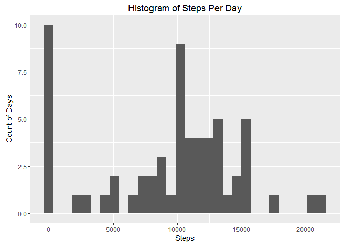
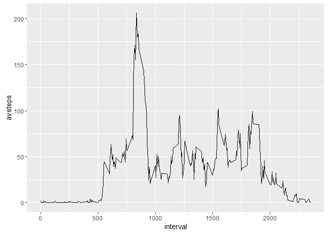
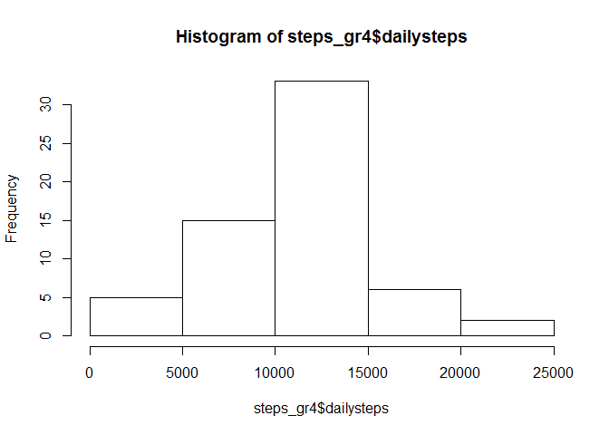
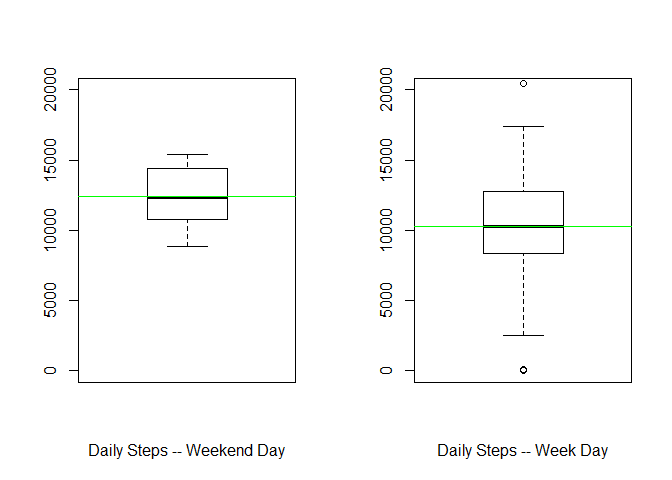

# Week 2 Course Project
Christopher Weiss  
July 7, 2016  


# Code for reading in the dataset and/or processing the data

Loading the .csv of the data into the variable rawdata.


```r
rawdata <- read.csv("activity.csv")
rawdata$date <- as.Date(rawdata$date)
str(rawdata)
```

```
## 'data.frame':	17568 obs. of  3 variables:
##  $ steps   : int  NA NA NA NA NA NA NA NA NA NA ...
##  $ date    : Date, format: "2012-10-01" "2012-10-01" ...
##  $ interval: int  0 5 10 15 20 25 30 35 40 45 ...
```


# Histogram of the total number of steps taken each day

I am using ggplot2 to create the histogram.  There are many NA values, and I am 
going to ignore them for the analysis.


```r
steps_gr <- 
  rawdata %>% 
  group_by(date) %>% 
  summarize(totalsteps=sum(steps, na.rm=TRUE))
g <- qplot(steps_gr$totalsteps, 
           xlab="Steps",
           ylab="Count of Days",
           main="Histogram of Steps Per Day")
g
```

```
## `stat_bin()` using `bins = 30`. Pick better value with `binwidth`.
```

<!-- -->


# Mean and median number of steps taken each day

The mean and median number of steps taken each day can be given easily by the summary function.


```r
summary(steps_gr$totalsteps)
```

```
##    Min. 1st Qu.  Median    Mean 3rd Qu.    Max. 
##       0    6778   10400    9354   12810   21190
```


# Time series plot of the average number of steps taken

Using the line plot function in ggplot2, this time using data that
has been summarized by interval, rather than by day, as above.


```r
steps_gr2 <- 
  rawdata %>% 
  group_by(interval) %>% 
  summarize(avsteps=mean(steps, na.rm=TRUE))
g <- ggplot(steps_gr2, aes(x=interval,y=avsteps))
g + geom_line()
```

<!-- -->

# The 5-minute interval that, on average, contains the maximum number of steps

The maxium number of steps can be found using the max function, then by returning
the observation with that average number of steps, and selecting the interval.

```r
maxint <- max(steps_gr2$avsteps)
t <- subset(steps_gr2, avsteps==maxint)
t$interval
```

```
## [1] 835
```

# Code to describe and show a strategy for imputing missing data

First, I am going to make some assumptions:
1) the number of steps is dependent on the time of day
2) the number of steps is dependent on the day of the week

Therefore, for any NA value, I will attempt to use the mean of the
other datapoints with the same day of the week and the same interval.
It is possible that this won't work, because there might not be
any valid weekday/interval datapoints from which to calculate a mean,
so I will have to check for that.

```r
rawdata$weekday <- weekdays(rawdata$date)
steps_gr3 <-
  rawdata %>%
  group_by(weekday, interval) %>%
  summarize(avsteps = mean(steps, na.rm=TRUE))

imp_data <- rawdata

for(i in 1:nrow(imp_data)){
  if (is.na(imp_data[i,c("steps")])) {
    int <- imp_data[i,c("interval")]
    w <- imp_data[i,c("weekday")]
    imp_data[i,"steps"] <- subset(steps_gr3, weekday==w & interval==int)$avsteps
  } 
}

summary(rawdata$steps)
```

```
##    Min. 1st Qu.  Median    Mean 3rd Qu.    Max.    NA's 
##    0.00    0.00    0.00   37.38   12.00  806.00    2304
```

```r
summary(imp_data$steps)
```

```
##    Min. 1st Qu.  Median    Mean 3rd Qu.    Max. 
##    0.00    0.00    0.00   37.57   19.04  806.00
```


# Histogram of the total number of steps taken each day after missing values are imputed

Using the imputed dataset imp_data from above, and grouping by day, gives the following plot:

```r
steps_gr4 <-
  imp_data %>%
  group_by(date) %>%
  summarise(dailysteps=sum(steps))

hist(steps_gr4$dailysteps)
```

<!-- -->


# Panel plot comparing the average number of steps taken per 5-minute interval across weekdays and weekends

Here I have created two subsets of the (imputed) data; one for weekdays and one for weekends.  Then, using base plot, I have created two boxplots.  By making the y axes identical, it makes it easy to
compare across the two subset of data.  The key observation here is that the weekend days seem to have a smaller variation of the number of steps, as well as a higher mean.

```r
e<- unique(rawdata$weekday)[1:5]
e
```

```
## [1] "Monday"    "Tuesday"   "Wednesday" "Thursday"  "Friday"
```

```r
d <- unique(rawdata$weekday)[6:7]
d
```

```
## [1] "Saturday" "Sunday"
```

```r
we <- 
  subset(imp_data, weekday %in% d) %>% 
  group_by(date) %>% 
  summarise(dailysteps=sum(steps))
wd <- 
  subset(imp_data, weekday %in% e) %>% 
  group_by(date) %>% 
  summarise(dailysteps=sum(steps))

par(mfrow=c(1,2))
boxplot(we$dailysteps,
        ylim=c(0,20000),
        xlab="Daily Steps -- Weekend Day")
abline(h=mean(we$dailysteps),col="green")
boxplot(wd$dailysteps,
        ylim=c(0,20000),
        xlab="Daily Steps -- Week Day")
abline(h=mean(wd$dailysteps),col="green")
```

<!-- -->

